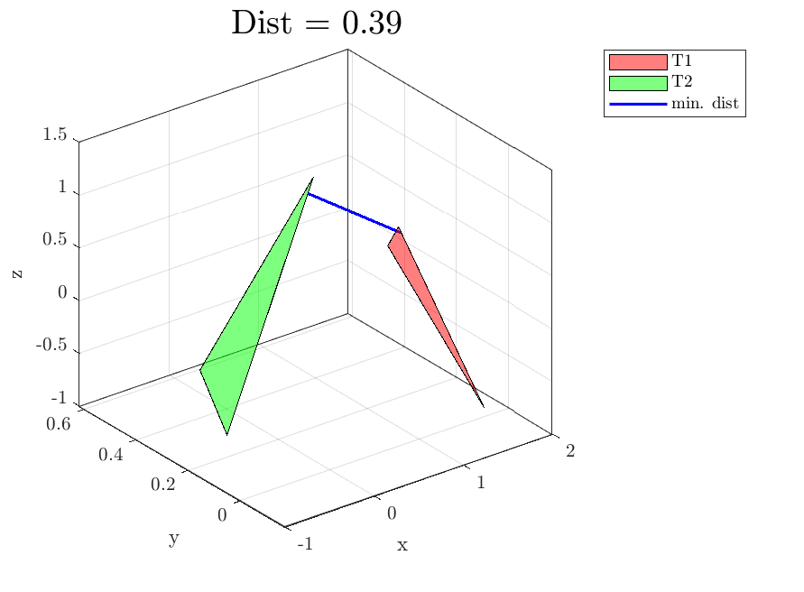

# Minimum Distance Between Two Triangles in 3D Coordinates
Set of functions that allow to compute the miminum distance between two triangles in 3D space in MATLAB.

Triangles are defines as `1x9` MATLAB arrays, encoded as `[x1,y1,z1, x2,y2,z2, x3,y3,z3]`, i.e., groups of 3 cartesian coordinates per vertex.
The repository includes a simple test (`minTriangDistTest`) and a simple visualizer (`minTriangDistVisualization`), making it easier to understand how it works.

The simplest working example would be as follows:
```matlab
T1 = randn(1, 9);
T2 = randn(1, 9);
[dist, p1, p2] = simdTriTri2(T1,T2);
```

A visualization example is here reported as well:


The code has been translated from optimized C++ SSE/SIMD directly into unoptimized MATLAB code.
Variables, inputs, outputs, and function names have been kept the same for a 1-to-1 comparison with the original code.

**Reference**: Shellshear, E., & Ytterlid, R. (2014). Fast Distance Queries for Triangles, Lines, and Points using SSE Instructions. Journal of Computer Graphics Techniques (JCGT), 3(4), 86–110. Retrieved from http://jcgt.org/published/0003/04/05/
